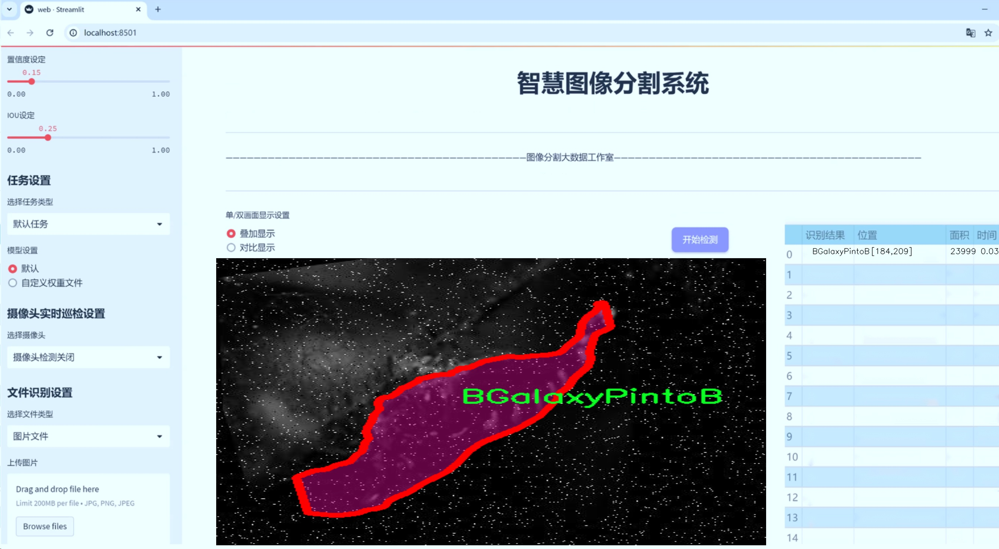
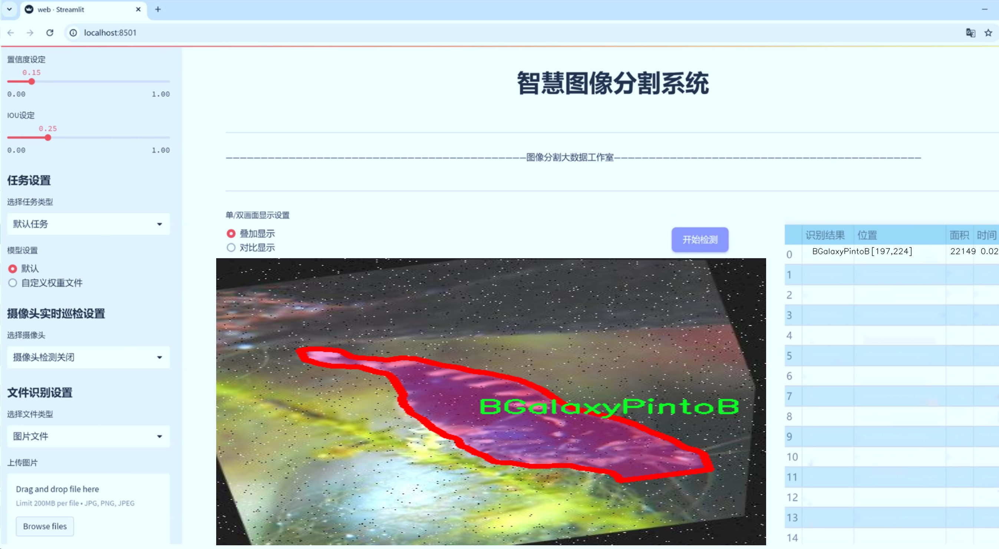
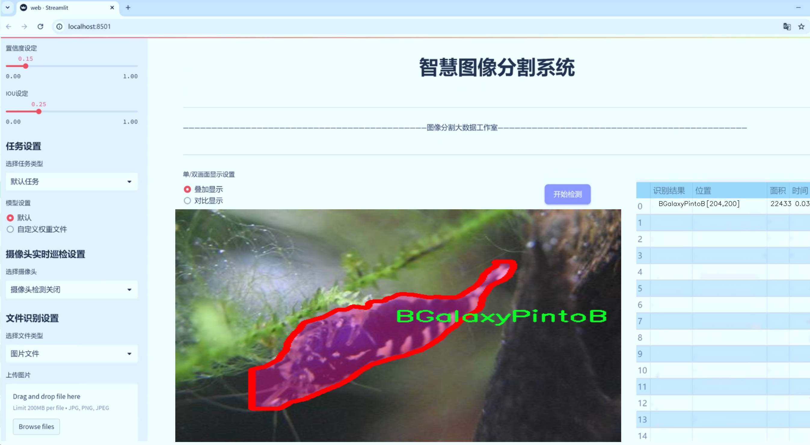
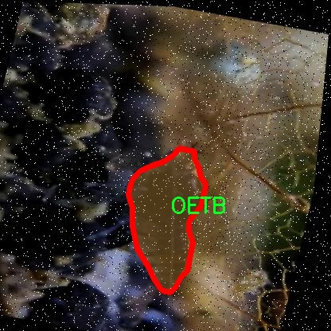
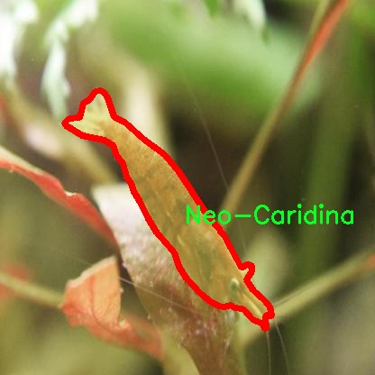
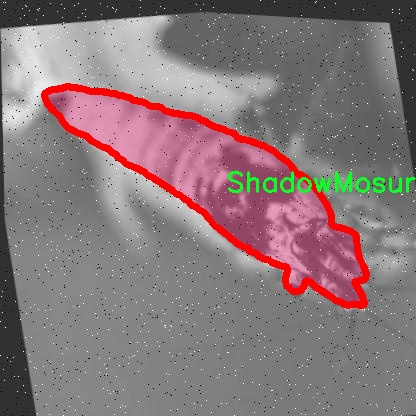
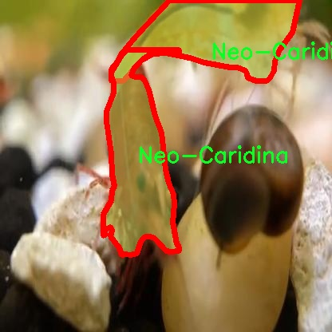
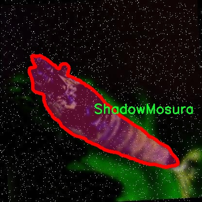

# 水族箱虾类图像分割系统源码＆数据集分享
 [yolov8-seg-p2＆yolov8-seg-AIFI等50+全套改进创新点发刊_一键训练教程_Web前端展示]

### 1.研究背景与意义

项目参考[ILSVRC ImageNet Large Scale Visual Recognition Challenge](https://gitee.com/YOLOv8_YOLOv11_Segmentation_Studio/projects)

项目来源[AAAI Global Al lnnovation Contest](https://kdocs.cn/l/cszuIiCKVNis)

研究背景与意义

随着水族养殖业的快速发展，尤其是虾类的观赏性和经济价值日益凸显，水族箱虾类的识别与管理成为了一个重要的研究领域。虾类作为水族箱生态系统中的重要组成部分，其种类繁多、形态各异，涵盖了如BGalaxyPintoB、BlueBolt、FancyTigerB等多达13个不同品种。这些虾类不仅在水族爱好者中受到青睐，也在生态研究和商业养殖中占据了重要地位。因此，建立一个高效、准确的水族箱虾类图像分割系统显得尤为重要。

在这一背景下，计算机视觉技术的迅猛发展为水族箱虾类的识别与分类提供了新的机遇。YOLO（You Only Look Once）系列模型以其高效的实时检测能力和优越的准确性，成为了目标检测领域的热门选择。尤其是YOLOv8的推出，进一步提升了模型在复杂场景下的表现能力，能够更好地适应水族箱这一动态且多变的环境。然而，传统的YOLOv8模型在处理细粒度图像分割任务时，仍然存在一定的局限性，尤其是在对小物体和相似物体的区分上。因此，基于改进YOLOv8的水族箱虾类图像分割系统的研究具有重要的理论和实践意义。

本研究旨在通过改进YOLOv8模型，结合实例分割技术，提升水族箱虾类的检测与分割精度。数据集包含了10000张水族箱虾类的图像，涵盖了13个不同的虾类品种，这为模型的训练和验证提供了丰富的样本基础。通过对这些图像进行深入分析，我们可以提取出不同虾类的特征信息，进而优化模型的结构与参数设置，以提高其在实际应用中的表现。

此外，水族箱虾类的图像分割系统不仅能够为水族爱好者提供更为精准的虾类识别服务，还能够为水族养殖业提供数据支持，帮助养殖者实时监测虾类的生长状态与健康状况。通过自动化的图像分割与分析，养殖者可以及时发现潜在的问题，优化养殖环境，提高养殖效率。同时，该系统的应用也将推动水族箱生态研究的发展，为相关领域的科学研究提供新的数据支持和分析工具。

综上所述，基于改进YOLOv8的水族箱虾类图像分割系统的研究，不仅具有重要的学术价值，还具备广泛的应用前景。通过这一研究，我们期望能够为水族箱虾类的管理与保护提供有效的技术手段，促进水族养殖业的可持续发展，推动相关领域的进一步研究与探索。

### 2.图片演示







##### 注意：由于此博客编辑较早，上面“2.图片演示”和“3.视频演示”展示的系统图片或者视频可能为老版本，新版本在老版本的基础上升级如下：（实际效果以升级的新版本为准）

  （1）适配了YOLOV8的“目标检测”模型和“实例分割”模型，通过加载相应的权重（.pt）文件即可自适应加载模型。

  （2）支持“图片识别”、“视频识别”、“摄像头实时识别”三种识别模式。

  （3）支持“图片识别”、“视频识别”、“摄像头实时识别”三种识别结果保存导出，解决手动导出（容易卡顿出现爆内存）存在的问题，识别完自动保存结果并导出到tempDir中。

  （4）支持Web前端系统中的标题、背景图等自定义修改，后面提供修改教程。

  另外本项目提供训练的数据集和训练教程,暂不提供权重文件（best.pt）,需要您按照教程进行训练后实现图片演示和Web前端界面演示的效果。

### 3.视频演示

[3.1 视频演示](https://www.bilibili.com/video/BV1s6yPYMEfE/)

### 4.数据集信息展示

##### 4.1 本项目数据集详细数据（类别数＆类别名）

nc: 13
names: ['BGalaxyPintoB', 'BlueBolt', 'CRS-CBS', 'FancyTigerB', 'KingKongB', 'Neo-Caridina', 'OETB', 'PandaB', 'RGalaxyPintoB', 'RacoonTigerB', 'ShadowMosura', 'TangerineTigerB', 'WhiteGoldenB']


##### 4.2 本项目数据集信息介绍

数据集信息展示

在水族箱虾类图像分割系统的研究中，"Aquarium Shrimp Detection (Caridina_NeoCaridina)" 数据集扮演了至关重要的角色。该数据集专为训练和改进YOLOv8-seg模型而设计，旨在提升水族箱中虾类的检测与分割精度。数据集包含13个类别，涵盖了多种不同品种的虾类，具体类别包括BGalaxyPintoB、BlueBolt、CRS-CBS、FancyTigerB、KingKongB、Neo-Caridina、OETB、PandaB、RGalaxyPintoB、RacoonTigerB、ShadowMosura、TangerineTigerB和WhiteGoldenB。这些类别的多样性不仅反映了水族箱虾类的丰富性，也为模型的训练提供了丰富的样本数据，确保其在实际应用中的有效性和可靠性。

数据集中每个类别的样本图像均经过精心挑选和标注，确保每一张图像都能清晰地展示出该虾类的特征。这些图像不仅包括虾类在水族箱中的自然状态，还涵盖了不同光照、背景和水质条件下的表现。这种多样化的样本选择使得模型在面对各种实际环境时，能够更好地进行识别和分割。通过使用这些图像，YOLOv8-seg模型能够学习到每种虾类的独特特征，如体型、颜色、纹理等，从而提高其在复杂背景下的检测能力。

在进行图像分割时，数据集中的标注信息尤为重要。每个类别的虾类在图像中都被精确地标注，形成了清晰的分割区域。这种高质量的标注不仅有助于模型的训练，也为后续的性能评估提供了可靠的依据。通过对比模型输出的分割结果与数据集中提供的真实标注，研究人员能够准确评估模型的表现，并针对性地进行改进。

此外，数据集的构建考虑到了不同虾类在水族箱环境中的行为和活动特征。例如，某些虾类可能在特定的环境中更为活跃，而另一些则可能更喜欢隐藏在水草中。这种行为差异在数据集中得到了充分体现，使得模型在训练过程中能够学习到更为丰富的上下文信息，从而提升其在实际应用中的适应性。

总之，"Aquarium Shrimp Detection (Caridina_NeoCaridina)" 数据集不仅为YOLOv8-seg模型的训练提供了坚实的基础，也为水族箱虾类的图像分割研究开辟了新的方向。通过对这一数据集的深入分析和应用，研究人员能够不断优化模型性能，推动水族箱虾类检测技术的发展。随着技术的进步和数据集的不断丰富，未来的水族箱虾类监测和管理将变得更加智能化和高效化。











### 5.全套项目环境部署视频教程（零基础手把手教学）

[5.1 环境部署教程链接（零基础手把手教学）](https://www.bilibili.com/video/BV1jG4Ve4E9t/?vd_source=bc9aec86d164b67a7004b996143742dc)


[5.2 安装Python虚拟环境创建和依赖库安装视频教程链接（零基础手把手教学）](https://www.bilibili.com/video/BV1nA4VeYEze/?vd_source=bc9aec86d164b67a7004b996143742dc)

### 6.手把手YOLOV8-seg训练视频教程（零基础小白有手就能学会）

[6.1 手把手YOLOV8-seg训练视频教程（零基础小白有手就能学会）](https://www.bilibili.com/video/BV1cA4VeYETe/?vd_source=bc9aec86d164b67a7004b996143742dc)


按照上面的训练视频教程链接加载项目提供的数据集，运行train.py即可开始训练



     Epoch   gpu_mem       box       obj       cls    labels  img_size
     1/200     0G   0.01576   0.01955  0.007536        22      1280: 100%|██████████| 849/849 [14:42<00:00,  1.04s/it]
               Class     Images     Labels          P          R     mAP@.5 mAP@.5:.95: 100%|██████████| 213/213 [01:14<00:00,  2.87it/s]
                 all       3395      17314      0.994      0.957      0.0957      0.0843

     Epoch   gpu_mem       box       obj       cls    labels  img_size
     2/200     0G   0.01578   0.01923  0.007006        22      1280: 100%|██████████| 849/849 [14:44<00:00,  1.04s/it]
               Class     Images     Labels          P          R     mAP@.5 mAP@.5:.95: 100%|██████████| 213/213 [01:12<00:00,  2.95it/s]
                 all       3395      17314      0.996      0.956      0.0957      0.0845

     Epoch   gpu_mem       box       obj       cls    labels  img_size
     3/200     0G   0.01561    0.0191  0.006895        27      1280: 100%|██████████| 849/849 [10:56<00:00,  1.29it/s]
               Class     Images     Labels          P          R     mAP@.5 mAP@.5:.95: 100%|███████   | 187/213 [00:52<00:00,  4.04it/s]
                 all       3395      17314      0.996      0.957      0.0957      0.0845


### 7.50+种全套YOLOV8-seg创新点代码加载调参视频教程（一键加载写好的改进模型的配置文件）

[7.1 50+种全套YOLOV8-seg创新点代码加载调参视频教程（一键加载写好的改进模型的配置文件）](https://www.bilibili.com/video/BV1Hw4VePEXv/?vd_source=bc9aec86d164b67a7004b996143742dc)

### 8.YOLOV8-seg图像分割算法原理

原始YOLOv8-seg算法原理

YOLOv8-seg算法是YOLO系列中的最新进展，旨在为目标检测和分割任务提供高效、准确的解决方案。该算法不仅继承了YOLO系列的优良传统，还在多个方面进行了创新与改进，以适应日益复杂的视觉任务。YOLOv8-seg算法的核心在于其网络结构的设计与优化，主要分为输入端、主干网络和检测端三个部分。

首先，在输入端，YOLOv8-seg算法采用了一种灵活的数据预处理策略，以适应不同场景的需求。通过引入多种数据增强技术，尤其是对Mosaic增强的适度调整，YOLOv8-seg能够在保持模型鲁棒性的同时，减少对真实数据分布的干扰。在训练的最后10个epoch中，YOLOv8-seg会停止使用Mosaic增强，这一策略旨在避免模型学习到不良信息，从而提高模型的泛化能力。

接下来，主干网络是YOLOv8-seg的关键组成部分。与之前的YOLO版本相比，YOLOv8-seg在主干网络中进行了显著的结构调整。具体而言，YOLOv8-seg将C3模块替换为C2f模块。C2f模块的设计灵感来源于YOLOv7中的ELAN模块，它通过引入更多的跳层连接，增强了梯度流动的丰富性。这种结构的改进使得模型在保持轻量化的同时，能够更有效地捕捉特征信息，从而提升检测和分割的精度。此外，YOLOv8-seg依然保留了SPPF（Spatial Pyramid Pooling Fast）模块，这一模块在保证性能的同时，显著减少了计算时间，进一步提高了算法的效率。

在检测端，YOLOv8-seg采用了现代流行的解耦合头结构，将分类和检测任务分离。这一设计使得模型在处理复杂场景时，能够更好地平衡分类和定位的性能。此外，YOLOv8-seg摒弃了传统的Anchor-Based方法，转而采用Anchor-Free策略，这一转变使得模型在面对不同尺度和形状的目标时，能够更加灵活和高效。

在损失函数的设计上，YOLOv8-seg同样进行了创新。它采用了BCELoss作为分类损失，DFLLoss和CIoULoss作为回归损失。这种组合不仅提高了模型的训练稳定性，还增强了对目标边界的精确定位能力，从而提升了分割任务的效果。

总的来说，YOLOv8-seg算法在多个方面进行了深入的探索与优化，旨在实现更高效的目标检测与分割。通过灵活的数据增强策略、创新的网络结构设计、解耦合的检测头以及精心设计的损失函数，YOLOv8-seg展现出了优越的性能和广泛的应用潜力。随着计算机视觉技术的不断发展，YOLOv8-seg无疑将成为研究者和工程师们在实际应用中不可或缺的工具。


### 9.系统功能展示（检测对象为举例，实际内容以本项目数据集为准）

图9.1.系统支持检测结果表格显示

  图9.2.系统支持置信度和IOU阈值手动调节

  图9.3.系统支持自定义加载权重文件best.pt(需要你通过步骤5中训练获得)

  图9.4.系统支持摄像头实时识别

  图9.5.系统支持图片识别

  图9.6.系统支持视频识别

  图9.7.系统支持识别结果文件自动保存

  图9.8.系统支持Excel导出检测结果数据


### 10.50+种全套YOLOV8-seg创新点原理讲解（非科班也可以轻松写刊发刊，V11版本正在科研待更新）

#### 10.1 由于篇幅限制，每个创新点的具体原理讲解就不一一展开，具体见下列网址中的创新点对应子项目的技术原理博客网址【Blog】：


[10.1 50+种全套YOLOV8-seg创新点原理讲解链接](https://gitee.com/qunmasj/good)

#### 10.2 部分改进模块原理讲解(完整的改进原理见上图和技术博客链接)【如果此小节的图加载失败可以通过CSDN或者Github搜索该博客的标题访问原始博客，原始博客图片显示正常】

### YOLOv8简介
YOLOv8是一种目标检测模型，是基于YOLO (You Only Look Once)系列算法发展而来的最新版本。它的核心思想是将目标检测任务转化为一个回归问题，通过单次前向传播即可直接预测出图像中的多个目标的位置和类别。
YOLOv8的网络结构采用了Darknet作为其主干网络，主要由卷积层和池化层构成。与之前的版本相比，YOLOv8在网络结构上进行了改进，引入了更多的卷积层和残差模块，以提高模型的准确性和鲁棒性。
YOLOv8采用了一种特征金字塔网络(Feature Pyramid Network,FPN)的结构，通过在不同层级上融合多尺度的特征信息，可以对不同尺度的目标进行有效的检测。此外，YOLOv8还引入了一种自适应感知域(Adaptive Anchors
的机制，通过自适应地学习目标的尺度和
长宽比，提高了模型对于不同尺度和形状目标的检测效果。
总体来说，YOLOv8结构模型综合了多个先进的目标检测技术，在保证检测速度的同时提升了检测精度和鲁棒性，被广泛应用于实时目标检测任务中。


#### yolov8网络模型结构图

YOLOv8 (You Only Look Once version 8)是一种目标检测算法，它在实时场景下可以快速准确地检测图像中的目标。
YOLOv8的网络模型结构基于Darknet框架，由一系列卷积层、池化层和全连接层组成。主要包含以下几个组件:
1.输入层:接收输入图像。
2.卷积层:使用不同尺寸的卷积核来提取图像特征。
3.残差块(Residual blocks):通过使用跳跃连接(skip connections）来解决梯度消失问题，使得网络更容易训练。
4.上采样层(Upsample layers):通过插值操作将特征图的尺寸放大，以便在不同尺度上进行目标检测。
5.池化层:用于减小特征图的尺寸，同时保留重要的特征。
6.1x1卷积层:用于降低通道数，减少网络参数量。
7.3x3卷积层:用于进—步提取和组合特征。
8.全连接层:用于最后的目标分类和定位。
YOLOv8的网络结构采用了多个不同尺度的特征图来检测不同大小的目标，从而提高了目标检测的准确性和多尺度性能。
请注意，YOLOv8网络模型结构图的具体细节可能因YOLO版本和实现方式而有所不同。


#### yolov8模型结构
YOLOv8模型是一种目标检测模型，其结构是基于YOLOv3模型进行改进的。模型结构可以分为主干网络和检测头两个部分。
主干网络是一种由Darknet-53构成的卷积神经网络。Darknet-53是一个经过多层卷积和残差连接构建起来的深度神经网络。它能够提取图像的特征信息，并将这些信息传递给检测头。
检测头是YOLOv8的关键部分，它负责在图像中定位和识别目标。检测头由一系列卷积层和全连接层组成。在每个检测头中，会生成一组锚框，并针对每个锚框预测目标的类别和位置信息。
YOLOv8模型使用了预训练的权重，其中在COCO数据集上进行了训练。这意味着该模型已经通过大规模数据集的学习，具有一定的目标检测能力。

### RT-DETR骨干网络HGNetv2简介
#### RT-DETR横空出世
前几天被百度的RT-DETR刷屏，参考该博客提出的目标检测新范式对原始DETR的网络结构进行了调整和优化，以提高计算速度和减小模型大小。这包括使用更轻量级的基础网络和调整Transformer结构。并且，摒弃了nms处理的detr结构与传统的物体检测方法相比，不仅训练是端到端的，检测也能端到端，这意味着整个网络在训练过程中一起进行优化，推理过程不需要昂贵的后处理代价，这有助于提高模型的泛化能力和性能。


当然，人们对RT-DETR之所以产生浓厚的兴趣，我觉得大概率还是对YOLO系列审美疲劳了，就算是出到了YOLO10086，我还是只想用YOLOv5和YOLOv7的框架来魔改做业务。。

#### 初识HGNet
看到RT-DETR的性能指标，发现指标最好的两个模型backbone都是用的HGNetv2，毫无疑问，和当时的picodet一样，骨干都是使用百度自家的网络。初识HGNet的时候，当时是参加了第四届百度网盘图像处理大赛，文档图像方向识别专题赛道，简单来说，就是使用分类网络对一些文档截图或者图片进行方向角度分类。


当时的方案并没有那么快定型，通常是打榜过程发现哪个网络性能好就使用哪个网络做魔改，而且木有显卡，只能蹭Ai Studio的平台，不过v100一天8小时的实验时间有点短，这也注定了大模型用不了。 

流水的模型，铁打的炼丹人，最后发现HGNet-tiny各方面指标都很符合我们的预期，后面就一直围绕它魔改。当然，比赛打榜是目的，学习才是享受过程，当时看到效果还可以，便开始折腾起了HGNet的网络架构，我们可以看到，PP-HGNet 针对 GPU 设备，对目前 GPU 友好的网络做了分析和归纳，尽可能多的使用 3x3 标准卷积（计算密度最高），PP-HGNet是由多个HG-Block组成，细节如下：


ConvBNAct是啥？简单聊一聊，就是Conv+BN+Act，CV Man应该最熟悉不过了：
```python
class ConvBNAct(TheseusLayer):
    def __init__(self,
                 in_channels,
                 out_channels,
                 kernel_size,
                 stride,
                 groups=1,
                 use_act=True):
        super().__init__()
        self.use_act = use_act
        self.conv = Conv2D(
            in_channels,
            out_channels,
            kernel_size,
            stride,
            padding=(kernel_size - 1) // 2,
            groups=groups,
            bias_attr=False)
        self.bn = BatchNorm2D(
            out_channels,
            weight_attr=ParamAttr(regularizer=L2Decay(0.0)),
            bias_attr=ParamAttr(regularizer=L2Decay(0.0)))
        if self.use_act:
            self.act = ReLU()
 
    def forward(self, x):
        x = self.conv(x)
        x = self.bn(x)
        if self.use_act:
            x = self.act(x)
        return x 
```
且标准卷积的数量随层数深度增加而增多，从而得到一个有利于 GPU 推理的骨干网络，同样速度下，精度也超越其他 CNN ，性价比也优于ViT-base模型。


另外，我们可以看到：

PP-HGNet 的第一层由channel为96的Stem模块构成，目的是为了减少参数量和计算量。PP-HGNet

Tiny的整体结构由四个HG Stage构成，而每个HG Stage主要由包含大量标准卷积的HG Block构成。

PP-HGNet的第三到第五层使用了使用了可学习的下采样层（LDS Layer），该层group为输入通道数，可达到降参降计算量的作用，且Tiny模型仅包含三个LDS Layer，并不会对GPU的利用率造成较大影响.

PP-HGNet的激活函数为Relu，常数级操作可保证该模型在硬件上的推理速度。

### 11.项目核心源码讲解（再也不用担心看不懂代码逻辑）

#### 11.1 ui.py

以下是代码的核心部分，并添加了详细的中文注释：

```python
import sys  # 导入系统模块，用于获取当前 Python 解释器的路径
import subprocess  # 导入子进程模块，用于执行外部命令

def run_script(script_path):
    """
    使用当前 Python 环境运行指定的脚本。

    Args:
        script_path (str): 要运行的脚本路径

    Returns:
        None
    """
    # 获取当前 Python 解释器的路径
    python_path = sys.executable

    # 构建运行命令，使用 streamlit 运行指定的脚本
    command = f'"{python_path}" -m streamlit run "{script_path}"'

    # 执行命令
    result = subprocess.run(command, shell=True)  # 运行命令并等待其完成
    if result.returncode != 0:  # 检查命令执行是否成功
        print("脚本运行出错。")  # 如果出错，输出错误信息

# 实例化并运行应用
if __name__ == "__main__":
    # 指定要运行的脚本路径
    script_path = "web.py"  # 这里可以直接指定脚本名称

    # 运行脚本
    run_script(script_path)  # 调用函数执行脚本
```

### 代码核心部分分析：
1. **导入模块**：引入 `sys` 和 `subprocess` 模块，前者用于获取 Python 解释器的路径，后者用于执行外部命令。
2. **`run_script` 函数**：定义了一个函数用于运行指定的 Python 脚本。该函数接受一个参数 `script_path`，表示要运行的脚本路径。
3. **获取 Python 解释器路径**：使用 `sys.executable` 获取当前 Python 解释器的完整路径。
4. **构建命令**：使用 f-string 构建运行命令，调用 `streamlit` 来运行指定的脚本。
5. **执行命令**：使用 `subprocess.run` 执行构建的命令，并等待其完成。
6. **错误处理**：检查命令的返回码，如果不为 0，表示执行出错，输出相应的错误信息。
7. **主程序入口**：在 `if __name__ == "__main__":` 块中，指定要运行的脚本路径，并调用 `run_script` 函数来执行该脚本。

这个文件名为 `ui.py`，它的主要功能是通过当前的 Python 环境来运行一个指定的脚本，具体来说是一个名为 `web.py` 的脚本。代码的结构相对简单，主要包含了导入模块、定义函数和执行主程序三个部分。

首先，代码导入了几个必要的模块，包括 `sys`、`os` 和 `subprocess`。其中，`sys` 模块用于访问与 Python 解释器相关的变量和函数，`os` 模块提供了与操作系统交互的功能，而 `subprocess` 模块则用于生成新的进程、连接到它们的输入/输出/错误管道，并获得它们的返回码。

接下来，代码定义了一个名为 `run_script` 的函数，该函数接受一个参数 `script_path`，表示要运行的脚本的路径。在函数内部，首先通过 `sys.executable` 获取当前 Python 解释器的路径。然后，构建一个命令字符串，该命令使用 `streamlit` 模块来运行指定的脚本。具体的命令格式为 `"{python_path}" -m streamlit run "{script_path}"`，这意味着它会调用 Python 解释器并通过 `-m` 参数运行 `streamlit` 模块，并指定要运行的脚本。

函数接着使用 `subprocess.run` 方法来执行构建好的命令。`shell=True` 参数表示命令将在一个新的 shell 中执行。执行完命令后，函数检查返回码，如果返回码不为零，说明脚本运行过程中出现了错误，程序会打印出“脚本运行出错”的提示信息。

最后，在 `if __name__ == "__main__":` 这部分，代码指定了要运行的脚本路径，这里使用了 `abs_path` 函数来获取 `web.py` 的绝对路径。然后调用 `run_script` 函数来执行这个脚本。

总的来说，这个 `ui.py` 文件的作用是提供一个简单的接口，通过命令行来运行一个基于 Streamlit 的 Web 应用脚本，便于用户在命令行环境中启动该应用。

#### 11.2 ultralytics\models\yolo\segment\__init__.py

```python
# 导入必要的模块
# Ultralytics YOLO 🚀, AGPL-3.0 license

# 从当前包中导入SegmentationPredictor类，用于图像分割的预测
from .predict import SegmentationPredictor

# 从当前包中导入SegmentationTrainer类，用于训练图像分割模型
from .train import SegmentationTrainer

# 从当前包中导入SegmentationValidator类，用于验证图像分割模型的性能
from .val import SegmentationValidator

# 定义当前模块的公开接口，允许外部访问SegmentationPredictor、SegmentationTrainer和SegmentationValidator
__all__ = 'SegmentationPredictor', 'SegmentationTrainer', 'SegmentationValidator'
``` 

### 代码核心部分及注释说明：
1. **导入模块**：代码的前几行负责导入图像分割相关的类，这些类分别用于预测、训练和验证。这样做的目的是将这些功能模块化，便于管理和使用。
   
2. **公开接口**：`__all__`变量定义了当前模块可以被外部访问的类，这样可以控制模块的导出内容，确保外部只访问到必要的部分。

这个程序文件是一个Python模块的初始化文件，位于Ultralytics YOLO项目的分割（segment）子模块中。文件的主要功能是导入和定义该模块中可用的类或函数，以便其他模块可以方便地使用。

首先，文件开头的注释部分表明了该项目是Ultralytics YOLO的一个实现，并且使用的是AGPL-3.0许可证。这意味着该代码是开源的，用户可以自由使用和修改，但在分发修改后的版本时需要遵循相同的许可证条款。

接下来，文件通过相对导入的方式引入了三个类：`SegmentationPredictor`、`SegmentationTrainer`和`SegmentationValidator`。这些类分别负责图像分割任务中的预测、训练和验证。具体来说：

- `SegmentationPredictor`类可能用于处理图像分割的预测过程，即给定输入图像后，模型会输出分割结果。
- `SegmentationTrainer`类则负责模型的训练过程，包括数据加载、模型优化等。
- `SegmentationValidator`类用于验证模型的性能，通常是在训练完成后对模型进行评估。

最后，`__all__`变量定义了模块的公共接口，列出了在使用`from module import *`语句时会被导入的名称。这意味着当其他模块导入这个`segment`模块时，只会看到`SegmentationPredictor`、`SegmentationTrainer`和`SegmentationValidator`这三个类，其他未列出的内容将不会被导入，从而帮助管理命名空间和避免不必要的冲突。

总体来说，这个文件的主要作用是组织和简化模块的结构，使得用户能够方便地访问与图像分割相关的功能。

#### 11.3 ultralytics\nn\extra_modules\ops_dcnv3\setup.py

以下是代码中最核心的部分，并附上详细的中文注释：

```python
import os
import glob
import torch
from torch.utils.cpp_extension import CUDA_HOME, CppExtension, CUDAExtension
from setuptools import find_packages, setup

# 定义所需的依赖包
requirements = ["torch", "torchvision"]

def get_extensions():
    # 获取当前文件的目录
    this_dir = os.path.dirname(os.path.abspath(__file__))
    # 定义扩展模块的源代码目录
    extensions_dir = os.path.join(this_dir, "src")

    # 获取主文件和CPU、CUDA源文件
    main_file = glob.glob(os.path.join(extensions_dir, "*.cpp"))
    source_cpu = glob.glob(os.path.join(extensions_dir, "cpu", "*.cpp"))
    source_cuda = glob.glob(os.path.join(extensions_dir, "cuda", "*.cu"))

    # 合并所有源文件
    sources = main_file + source_cpu
    extension = CppExtension  # 默认使用 CppExtension
    extra_compile_args = {"cxx": []}  # 编译参数
    define_macros = []  # 宏定义

    # 检查CUDA是否可用
    if torch.cuda.is_available() and CUDA_HOME is not None:
        extension = CUDAExtension  # 使用 CUDAExtension
        sources += source_cuda  # 添加CUDA源文件
        define_macros += [("WITH_CUDA", None)]  # 定义宏以启用CUDA支持
        extra_compile_args["nvcc"] = []  # CUDA编译参数
    else:
        raise NotImplementedError('Cuda is not available')  # 如果CUDA不可用，抛出异常

    # 生成完整的源文件路径
    sources = [os.path.join(extensions_dir, s) for s in sources]
    include_dirs = [extensions_dir]  # 包含目录

    # 创建扩展模块
    ext_modules = [
        extension(
            "DCNv3",  # 模块名称
            sources,  # 源文件列表
            include_dirs=include_dirs,  # 包含目录
            define_macros=define_macros,  # 宏定义
            extra_compile_args=extra_compile_args,  # 编译参数
        )
    ]
    return ext_modules  # 返回扩展模块列表

# 使用setuptools设置包信息
setup(
    name="DCNv3",  # 包名称
    version="1.1",  # 版本号
    author="InternImage",  # 作者
    url="https://github.com/OpenGVLab/InternImage",  # 项目链接
    description="PyTorch Wrapper for CUDA Functions of DCNv3",  # 描述
    packages=find_packages(exclude=("configs", "tests")),  # 查找包，排除特定目录
    ext_modules=get_extensions(),  # 获取扩展模块
    cmdclass={"build_ext": torch.utils.cpp_extension.BuildExtension},  # 自定义构建命令
)
```

### 代码核心部分说明：
1. **导入模块**：导入必要的库和模块，包括`os`、`glob`、`torch`和`setuptools`等。
2. **获取扩展函数**：`get_extensions`函数用于查找和准备C++和CUDA源文件，并根据CUDA的可用性选择合适的扩展类型（`CppExtension`或`CUDAExtension`）。
3. **编译参数和宏定义**：根据CUDA的可用性设置编译参数和宏定义，以支持CUDA功能。
4. **设置包信息**：使用`setuptools`的`setup`函数定义包的名称、版本、作者、描述等信息，并指定扩展模块。

这段代码的主要目的是为PyTorch提供一个CUDA功能的C++扩展模块DCNv3的构建配置。

这个程序文件是一个用于设置和编译DCNv3（Deformable Convolutional Networks v3）扩展模块的Python脚本，文件名为`setup.py`，位于`ultralytics/nn/extra_modules/ops_dcnv3/`目录下。它使用了`setuptools`和`torch.utils.cpp_extension`来构建C++和CUDA扩展。

首先，文件开头包含了一些版权信息和许可证声明，表明该代码是由OpenGVLab开发并遵循MIT许可证。

接下来，程序导入了一些必要的模块，包括`os`和`glob`用于文件路径操作，`torch`用于PyTorch的功能，以及`CUDA_HOME`、`CppExtension`和`CUDAExtension`用于编译C++和CUDA代码。

在`requirements`列表中，指定了该模块依赖的库，包括`torch`和`torchvision`。

`get_extensions`函数是该文件的核心部分，它负责查找和准备要编译的源文件。首先，获取当前目录和扩展源代码的目录。然后，使用`glob`模块查找扩展目录下的所有C++和CUDA源文件。主文件和CPU源文件被存储在`sources`列表中。

接下来，程序检查CUDA是否可用。如果可用，则使用`CUDAExtension`来编译CUDA源文件，并在`sources`列表中添加这些文件，同时定义了一个宏`WITH_CUDA`。如果CUDA不可用，程序会抛出一个`NotImplementedError`，表示不支持CUDA。

所有的源文件路径被整理成绝对路径，并设置了包含目录。然后，创建了一个扩展模块`ext_modules`，其中包含了模块的名称、源文件、包含目录、宏定义和编译参数。

最后，使用`setup`函数来配置包的元数据和构建信息，包括包的名称、版本、作者、项目网址、描述、排除的包（如`configs`和`tests`）以及扩展模块和构建命令类。

总体而言，这个`setup.py`文件的目的是为DCNv3模块提供必要的编译和安装支持，使其能够在PyTorch环境中使用。

#### 11.4 ultralytics\models\yolo\pose\val.py

以下是代码中最核心的部分，并附上详细的中文注释：

```python
class PoseValidator(DetectionValidator):
    """
    PoseValidator类扩展了DetectionValidator类，用于基于姿态模型的验证。
    """

    def __init__(self, dataloader=None, save_dir=None, pbar=None, args=None, _callbacks=None):
        """初始化PoseValidator对象，设置自定义参数和属性。"""
        super().__init__(dataloader, save_dir, pbar, args, _callbacks)  # 调用父类构造函数
        self.sigma = None  # 用于计算关键点的标准差
        self.kpt_shape = None  # 关键点的形状
        self.args.task = 'pose'  # 设置任务类型为姿态估计
        self.metrics = PoseMetrics(save_dir=self.save_dir, on_plot=self.on_plot)  # 初始化姿态评估指标

    def preprocess(self, batch):
        """预处理批次数据，将关键点数据转换为浮点数并移动到指定设备。"""
        batch = super().preprocess(batch)  # 调用父类的预处理方法
        batch['keypoints'] = batch['keypoints'].to(self.device).float()  # 将关键点数据转换为浮点数并移动到设备
        return batch

    def postprocess(self, preds):
        """应用非极大值抑制，返回高置信度的检测结果。"""
        return ops.non_max_suppression(preds,
                                       self.args.conf,
                                       self.args.iou,
                                       labels=self.lb,
                                       multi_label=True,
                                       agnostic=self.args.single_cls,
                                       max_det=self.args.max_det,
                                       nc=self.nc)  # 进行非极大值抑制，返回处理后的预测结果

    def update_metrics(self, preds, batch):
        """更新评估指标。"""
        for si, pred in enumerate(preds):  # 遍历每个预测结果
            idx = batch['batch_idx'] == si  # 获取当前批次的索引
            cls = batch['cls'][idx]  # 获取当前批次的类别
            bbox = batch['bboxes'][idx]  # 获取当前批次的边界框
            kpts = batch['keypoints'][idx]  # 获取当前批次的关键点
            nl, npr = cls.shape[0], pred.shape[0]  # 获取标签和预测的数量
            nk = kpts.shape[1]  # 获取关键点的数量
            shape = batch['ori_shape'][si]  # 获取原始图像的形状
            correct_kpts = torch.zeros(npr, self.niou, dtype=torch.bool, device=self.device)  # 初始化正确的关键点
            correct_bboxes = torch.zeros(npr, self.niou, dtype=torch.bool, device=self.device)  # 初始化正确的边界框
            self.seen += 1  # 更新已处理的样本数量

            if npr == 0:  # 如果没有预测结果
                if nl:  # 如果有标签
                    self.stats.append((correct_bboxes, correct_kpts, *torch.zeros((2, 0), device=self.device), cls.squeeze(-1)))
                continue  # 继续下一个批次

            # 处理预测结果
            predn = pred.clone()  # 克隆预测结果
            ops.scale_boxes(batch['img'][si].shape[1:], predn[:, :4], shape, ratio_pad=batch['ratio_pad'][si])  # 将预测框缩放到原始图像空间
            pred_kpts = predn[:, 6:].view(npr, nk, -1)  # 获取预测的关键点并调整形状

            # 评估
            if nl:  # 如果有标签
                height, width = batch['img'].shape[2:]  # 获取图像的高度和宽度
                tbox = ops.xywh2xyxy(bbox) * torch.tensor((width, height, width, height), device=self.device)  # 将标签框转换为xyxy格式
                ops.scale_boxes(batch['img'][si].shape[1:], tbox, shape, ratio_pad=batch['ratio_pad'][si])  # 缩放标签框
                tkpts = kpts.clone()  # 克隆关键点
                tkpts[..., 0] *= width  # 缩放关键点的x坐标
                tkpts[..., 1] *= height  # 缩放关键点的y坐标
                tkpts = ops.scale_coords(batch['img'][si].shape[1:], tkpts, shape, ratio_pad=batch['ratio_pad'][si])  # 缩放关键点到原始图像空间
                labelsn = torch.cat((cls, tbox), 1)  # 合并类别和边界框
                correct_bboxes = self._process_batch(predn[:, :6], labelsn)  # 处理边界框
                correct_kpts = self._process_batch(predn[:, :6], labelsn, pred_kpts, tkpts)  # 处理关键点

            # 更新统计信息
            self.stats.append((correct_bboxes, correct_kpts, pred[:, 4], pred[:, 5], cls.squeeze(-1)))

    def _process_batch(self, detections, labels, pred_kpts=None, gt_kpts=None):
        """
        返回正确的预测矩阵。

        参数:
            detections (torch.Tensor): 形状为[N, 6]的检测结果张量。
            labels (torch.Tensor): 形状为[M, 5]的标签张量。
            pred_kpts (torch.Tensor, optional): 形状为[N, 51]的预测关键点张量。
            gt_kpts (torch.Tensor, optional): 形状为[N, 51]的真实关键点张量。

        返回:
            torch.Tensor: 形状为[N, 10]的正确预测矩阵。
        """
        if pred_kpts is not None and gt_kpts is not None:
            area = ops.xyxy2xywh(labels[:, 1:])[:, 2:].prod(1) * 0.53  # 计算目标区域
            iou = kpt_iou(gt_kpts, pred_kpts, sigma=self.sigma, area=area)  # 计算关键点的IoU
        else:  # 处理边界框
            iou = box_iou(labels[:, 1:], detections[:, :4])  # 计算边界框的IoU

        return self.match_predictions(detections[:, 5], labels[:, 0], iou)  # 返回匹配的预测结果
```

### 代码核心部分解释：
1. **PoseValidator类**：这是一个用于姿态估计的验证器，继承自DetectionValidator类。
2. **初始化方法**：设置一些基本参数，包括sigma和关键点形状，并初始化评估指标。
3. **预处理方法**：将输入批次中的关键点数据转换为浮点数并移动到指定设备。
4. **后处理方法**：对预测结果应用非极大值抑制，筛选出高置信度的检测结果。
5. **更新指标方法**：根据预测结果和真实标签更新评估指标，计算正确的边界框和关键点。
6. **处理批次方法**：计算预测结果与真实标签之间的匹配，返回正确的预测矩阵。

这些核心部分是PoseValidator类实现姿态估计验证的基础，负责数据处理、指标更新和结果评估。

这个程序文件是一个用于验证姿态估计模型的类，名为`PoseValidator`，它继承自`DetectionValidator`类。该类的主要功能是对基于YOLO（You Only Look Once）模型的姿态估计进行验证和评估。

在初始化方法中，`PoseValidator`接受多个参数，包括数据加载器、保存目录、进度条、参数和回调函数。它调用父类的初始化方法，并设置了一些特定于姿态估计的属性，如`self.sigma`和`self.kpt_shape`。如果设备是Apple的MPS（Metal Performance Shaders），则会发出警告，建议使用CPU进行姿态模型的计算。

`preprocess`方法用于对输入批次进行预处理，主要是将关键点数据转换为浮点数并移动到指定设备上。`get_desc`方法返回评估指标的描述信息，以便在输出时显示。

在`postprocess`方法中，程序应用非极大值抑制（NMS）来过滤掉低置信度的检测结果。`init_metrics`方法用于初始化姿态估计的评估指标，特别是处理关键点的形状和相关的标准差。

`update_metrics`方法是计算和更新评估指标的核心部分。它遍历每个预测结果，并根据真实标签计算正确的关键点和边界框。它还处理批次的预测结果，包括缩放预测框和关键点坐标，以适应原始图像的尺寸。此方法还支持保存预测结果为JSON格式。

`_process_batch`方法用于返回正确的预测矩阵，计算预测框和真实框之间的交并比（IoU），并根据IoU值匹配预测和标签。

`plot_val_samples`和`plot_predictions`方法用于可视化验证样本和预测结果，生成带有边界框和关键点的图像，并将其保存到指定目录。

`pred_to_json`方法将YOLO的预测结果转换为COCO格式的JSON，以便于后续的评估和分析。`eval_json`方法则使用COCO格式的JSON评估模型的性能，计算平均精度（mAP）等指标，并输出评估结果。

总体而言，这个文件实现了一个完整的姿态估计验证流程，包括数据预处理、指标计算、结果可视化和评估，适用于使用YOLO模型进行姿态估计的任务。

#### 11.5 ultralytics\engine\__init__.py

以下是保留的核心部分代码，并附上详细的中文注释：

```python
# Ultralytics YOLO 🚀, AGPL-3.0 license

# 这是一个YOLO（You Only Look Once）模型的实现代码，YOLO是一种用于目标检测的深度学习模型。

# 下面是模型的初始化和训练过程的核心部分

class YOLO:
    def __init__(self, model_path):
        # 初始化YOLO模型
        # model_path: 预训练模型的路径
        self.model = self.load_model(model_path)  # 加载模型

    def load_model(self, model_path):
        # 加载YOLO模型的方法
        # 这里可以使用深度学习框架（如PyTorch）来加载模型
        return torch.load(model_path)  # 返回加载的模型

    def predict(self, image):
        # 对输入图像进行目标检测的预测
        # image: 输入的图像数据
        results = self.model(image)  # 使用模型进行预测
        return results  # 返回预测结果

    def train(self, train_data, epochs):
        # 训练YOLO模型的方法
        # train_data: 训练数据集
        # epochs: 训练的轮数
        for epoch in range(epochs):
            # 在每个epoch中进行训练
            loss = self.train_one_epoch(train_data)  # 训练一个epoch并返回损失
            print(f'Epoch {epoch+1}/{epochs}, Loss: {loss}')  # 输出当前epoch的损失

    def train_one_epoch(self, train_data):
        # 训练一个epoch的方法
        # train_data: 训练数据集
        total_loss = 0  # 初始化总损失
        for batch in train_data:
            loss = self.update_model(batch)  # 更新模型并计算损失
            total_loss += loss  # 累加损失
        return total_loss / len(train_data)  # 返回平均损失

    def update_model(self, batch):
        # 更新模型的方法
        # batch: 当前批次的数据
        # 这里可以实现前向传播、计算损失、反向传播和优化步骤
        return loss  # 返回当前批次的损失
```

### 注释说明：
1. **YOLO类**：这是YOLO模型的核心类，包含模型的初始化、加载、预测和训练等方法。
2. **`__init__`方法**：构造函数，用于初始化YOLO模型并加载预训练模型。
3. **`load_model`方法**：负责加载指定路径的YOLO模型，通常使用深度学习框架的加载功能。
4. **`predict`方法**：对输入图像进行目标检测，返回检测结果。
5. **`train`方法**：训练模型的主方法，接受训练数据和训练轮数作为参数。
6. **`train_one_epoch`方法**：在一个训练轮次中对所有训练数据进行训练，计算并返回平均损失。
7. **`update_model`方法**：更新模型的具体实现，包括前向传播、损失计算和反向传播。

以上代码和注释提供了YOLO模型的基本结构和功能，适合用于目标检测任务。

该文件是Ultralytics YOLO项目的一部分，主要用于实现YOLO（You Only Look Once）目标检测算法。文件开头的注释表明该项目遵循AGPL-3.0许可证，这意味着该代码是开源的，用户可以自由使用、修改和分发，但需要遵循相应的许可证条款。

在这个`__init__.py`文件中，通常会包含一些初始化代码，使得该目录可以被视为一个Python包。虽然具体的代码内容没有提供，但一般来说，这类文件可能会导入其他模块、定义一些常量或配置参数，或者设置包的公共接口。

通过这个文件，用户可以方便地使用Ultralytics YOLO提供的功能，而不需要直接访问每个子模块。它可能会涉及到模型的加载、训练、推理等功能的封装，使得用户在使用时能够更加简洁和高效。

总的来说，这个文件是Ultralytics YOLO项目的一个重要组成部分，负责包的初始化和模块的组织，确保用户能够顺利地使用YOLO目标检测算法。

#### 11.6 train.py

以下是经过简化并注释的核心代码部分：

```python
import os
import torch
import yaml
from ultralytics import YOLO  # 导入YOLO模型库

if __name__ == '__main__':  # 确保该模块被直接运行时才执行以下代码
    # 设置训练参数
    workers = 1  # 数据加载工作进程数
    batch = 8  # 每个批次的样本数量
    device = "0" if torch.cuda.is_available() else "cpu"  # 判断是否使用GPU

    # 获取数据集配置文件的绝对路径
    data_path = abs_path(f'datasets/data/data.yaml', path_type='current')

    # 读取YAML文件，保持原有顺序
    with open(data_path, 'r') as file:
        data = yaml.load(file, Loader=yaml.FullLoader)

    # 修改数据集路径
    if 'train' in data and 'val' in data and 'test' in data:
        directory_path = os.path.dirname(data_path.replace(os.sep, '/'))  # 获取目录路径
        data['train'] = directory_path + '/train'  # 更新训练集路径
        data['val'] = directory_path + '/val'      # 更新验证集路径
        data['test'] = directory_path + '/test'    # 更新测试集路径

        # 将修改后的数据写回YAML文件
        with open(data_path, 'w') as file:
            yaml.safe_dump(data, file, sort_keys=False)

    # 加载YOLO模型配置和权重
    model = YOLO(r"C:\codeseg\codenew\50+种YOLOv8算法改进源码大全和调试加载训练教程（非必要）\改进YOLOv8模型配置文件\yolov8-seg-C2f-Faster.yaml").load("./weights/yolov8s-seg.pt")

    # 开始训练模型
    results = model.train(
        data=data_path,  # 指定训练数据的配置文件路径
        device=device,    # 指定使用的设备
        workers=workers,  # 指定数据加载工作进程数
        imgsz=640,        # 输入图像的大小
        epochs=100,       # 训练的轮数
        batch=batch,      # 每个批次的样本数量
    )
```

### 代码注释说明：
1. **导入必要的库**：引入了操作系统、PyTorch、YAML解析库和YOLO模型库。
2. **主程序入口**：使用`if __name__ == '__main__':`确保只有在直接运行该脚本时才执行后续代码。
3. **设置训练参数**：定义了数据加载的工作进程数、批次大小和设备（GPU或CPU）。
4. **获取数据集配置文件路径**：使用`abs_path`函数获取数据集的YAML配置文件的绝对路径。
5. **读取和修改YAML文件**：加载YAML文件，更新训练、验证和测试集的路径，并将修改后的内容写回文件。
6. **加载YOLO模型**：根据指定的配置文件和权重文件加载YOLO模型。
7. **训练模型**：调用`model.train`方法开始训练，传入数据路径、设备、工作进程数、图像大小、训练轮数和批次大小等参数。

该程序文件`train.py`主要用于训练YOLO（You Only Look Once）模型，具体是YOLOv8的一个变种，针对图像分割任务进行训练。程序首先导入了必要的库，包括操作系统库`os`、深度学习框架`torch`、YAML文件处理库`yaml`、YOLO模型库`ultralytics`以及用于图形界面的`matplotlib`。

在`__main__`模块中，程序首先设置了一些训练参数。`workers`变量指定了数据加载时使用的工作进程数量，`batch`变量定义了每个批次的样本数量，这里设置为8，用户可以根据显存和内存的情况进行调整。`device`变量则根据当前是否有可用的GPU来选择训练设备，如果有GPU则使用GPU，否则使用CPU。

接下来，程序通过`abs_path`函数获取数据集配置文件`data.yaml`的绝对路径，并将路径中的分隔符统一为Unix风格的斜杠。然后，程序读取该YAML文件，提取其中的训练、验证和测试数据路径，并将这些路径修改为绝对路径。修改后的数据路径会被写回到原YAML文件中，以确保后续训练时能够正确找到数据。

程序还提醒用户，不同的YOLO模型对设备的要求不同，如果当前模型出现错误，可以尝试其他模型进行测试。接着，程序加载了一个YOLOv8的配置文件和预训练权重文件，准备进行模型训练。

最后，调用`model.train`方法开始训练模型，传入了数据配置文件路径、设备、工作进程数量、输入图像大小（640x640）、训练的轮数（100个epoch）以及批次大小。通过这些设置，程序将开始训练YOLO模型，以适应特定的图像分割任务。

### 12.系统整体结构（节选）

### 整体功能和构架概括

该项目是一个基于YOLO（You Only Look Once）算法的深度学习框架，主要用于目标检测和图像分割任务。项目的结构模块化，包含多个子模块和文件，每个文件负责特定的功能。这些功能包括模型的训练、验证、推理、数据处理和模型构建等。项目的设计使得用户能够方便地进行模型的训练和评估，同时也提供了必要的工具和扩展模块，以支持更复杂的应用场景。

以下是项目中各个文件的功能概述：

| 文件路径                                      | 功能描述                                                                 |
|-------------------------------------------|-----------------------------------------------------------------------|
| `ui.py`                                   | 提供一个命令行接口来运行基于Streamlit的Web应用，主要用于模型的可视化和交互。         |
| `ultralytics/models/yolo/segment/__init__.py` | 初始化分割模块，导入相关的分割类（如`SegmentationPredictor`、`SegmentationTrainer`等）。 |
| `ultralytics/nn/extra_modules/ops_dcnv3/setup.py` | 设置和编译DCNv3（Deformable Convolutional Networks v3）扩展模块，支持CUDA和C++。 |
| `ultralytics/models/yolo/pose/val.py`    | 实现姿态估计模型的验证流程，包括数据预处理、指标计算、结果可视化和评估。          |
| `ultralytics/engine/__init__.py`         | 初始化YOLO引擎模块，组织和导入模型相关的功能，确保用户可以方便地使用YOLO算法。    |
| `train.py`                                | 负责训练YOLO模型，配置训练参数，加载数据集，启动训练过程。                       |
| `ultralytics/data/base.py`                | 定义数据加载和处理的基本类，支持不同类型的数据集。                              |
| `ultralytics/nn/backbone/VanillaNet.py`  | 实现VanillaNet网络结构，可能作为YOLO模型的主干网络。                             |
| `ultralytics/utils/ops.py`                | 提供一些通用的操作和工具函数，支持模型训练和推理过程中的各种操作。                |
| `ultralytics/models/sam/predict.py`      | 实现SAM（Segment Anything Model）模型的推理过程，可能用于图像分割任务。          |
| `ultralytics/models/yolo/model.py`       | 定义YOLO模型的结构和功能，包括前向传播、损失计算等。                             |
| `ultralytics/models/yolo/detect/train.py` | 实现YOLO模型的检测训练过程，可能包括数据增强、损失函数和优化器的设置。            |
| `ultralytics/cfg/__init__.py`            | 初始化配置模块，可能用于管理模型和训练的配置参数。                              |

这个表格总结了项目中各个文件的主要功能，帮助用户快速了解项目的结构和各个模块的作用。

注意：由于此博客编辑较早，上面“11.项目核心源码讲解（再也不用担心看不懂代码逻辑）”中部分代码可能会优化升级，仅供参考学习，完整“训练源码”、“Web前端界面”和“50+种创新点源码”以“14.完整训练+Web前端界面+50+种创新点源码、数据集获取”的内容为准。

### 13.图片、视频、摄像头图像分割Demo(去除WebUI)代码

在这个博客小节中，我们将讨论如何在不使用WebUI的情况下，实现图像分割模型的使用。本项目代码已经优化整合，方便用户将分割功能嵌入自己的项目中。
核心功能包括图片、视频、摄像头图像的分割，ROI区域的轮廓提取、类别分类、周长计算、面积计算、圆度计算以及颜色提取等。
这些功能提供了良好的二次开发基础。

### 核心代码解读

以下是主要代码片段，我们会为每一块代码进行详细的批注解释：

```python
import random
import cv2
import numpy as np
from PIL import ImageFont, ImageDraw, Image
from hashlib import md5
from model import Web_Detector
from chinese_name_list import Label_list

# 根据名称生成颜色
def generate_color_based_on_name(name):
    ......

# 计算多边形面积
def calculate_polygon_area(points):
    return cv2.contourArea(points.astype(np.float32))

...
# 绘制中文标签
def draw_with_chinese(image, text, position, font_size=20, color=(255, 0, 0)):
    image_pil = Image.fromarray(cv2.cvtColor(image, cv2.COLOR_BGR2RGB))
    draw = ImageDraw.Draw(image_pil)
    font = ImageFont.truetype("simsun.ttc", font_size, encoding="unic")
    draw.text(position, text, font=font, fill=color)
    return cv2.cvtColor(np.array(image_pil), cv2.COLOR_RGB2BGR)

# 动态调整参数
def adjust_parameter(image_size, base_size=1000):
    max_size = max(image_size)
    return max_size / base_size

# 绘制检测结果
def draw_detections(image, info, alpha=0.2):
    name, bbox, conf, cls_id, mask = info['class_name'], info['bbox'], info['score'], info['class_id'], info['mask']
    adjust_param = adjust_parameter(image.shape[:2])
    spacing = int(20 * adjust_param)

    if mask is None:
        x1, y1, x2, y2 = bbox
        aim_frame_area = (x2 - x1) * (y2 - y1)
        cv2.rectangle(image, (x1, y1), (x2, y2), color=(0, 0, 255), thickness=int(3 * adjust_param))
        image = draw_with_chinese(image, name, (x1, y1 - int(30 * adjust_param)), font_size=int(35 * adjust_param))
        y_offset = int(50 * adjust_param)  # 类别名称上方绘制，其下方留出空间
    else:
        mask_points = np.concatenate(mask)
        aim_frame_area = calculate_polygon_area(mask_points)
        mask_color = generate_color_based_on_name(name)
        try:
            overlay = image.copy()
            cv2.fillPoly(overlay, [mask_points.astype(np.int32)], mask_color)
            image = cv2.addWeighted(overlay, 0.3, image, 0.7, 0)
            cv2.drawContours(image, [mask_points.astype(np.int32)], -1, (0, 0, 255), thickness=int(8 * adjust_param))

            # 计算面积、周长、圆度
            area = cv2.contourArea(mask_points.astype(np.int32))
            perimeter = cv2.arcLength(mask_points.astype(np.int32), True)
            ......

            # 计算色彩
            mask = np.zeros(image.shape[:2], dtype=np.uint8)
            cv2.drawContours(mask, [mask_points.astype(np.int32)], -1, 255, -1)
            color_points = cv2.findNonZero(mask)
            ......

            # 绘制类别名称
            x, y = np.min(mask_points, axis=0).astype(int)
            image = draw_with_chinese(image, name, (x, y - int(30 * adjust_param)), font_size=int(35 * adjust_param))
            y_offset = int(50 * adjust_param)

            # 绘制面积、周长、圆度和色彩值
            metrics = [("Area", area), ("Perimeter", perimeter), ("Circularity", circularity), ("Color", color_str)]
            for idx, (metric_name, metric_value) in enumerate(metrics):
                ......

    return image, aim_frame_area

# 处理每帧图像
def process_frame(model, image):
    pre_img = model.preprocess(image)
    pred = model.predict(pre_img)
    det = pred[0] if det is not None and len(det)
    if det:
        det_info = model.postprocess(pred)
        for info in det_info:
            image, _ = draw_detections(image, info)
    return image

if __name__ == "__main__":
    cls_name = Label_list
    model = Web_Detector()
    model.load_model("./weights/yolov8s-seg.pt")

    # 摄像头实时处理
    cap = cv2.VideoCapture(0)
    while cap.isOpened():
        ret, frame = cap.read()
        if not ret:
            break
        ......

    # 图片处理
    image_path = './icon/OIP.jpg'
    image = cv2.imread(image_path)
    if image is not None:
        processed_image = process_frame(model, image)
        ......

    # 视频处理
    video_path = ''  # 输入视频的路径
    cap = cv2.VideoCapture(video_path)
    while cap.isOpened():
        ret, frame = cap.read()
        ......
```


### 14.完整训练+Web前端界面+50+种创新点源码、数据集获取


# [下载链接：https://mbd.pub/o/bread/Zp2YmJ9s](https://mbd.pub/o/bread/Zp2YmJ9s)